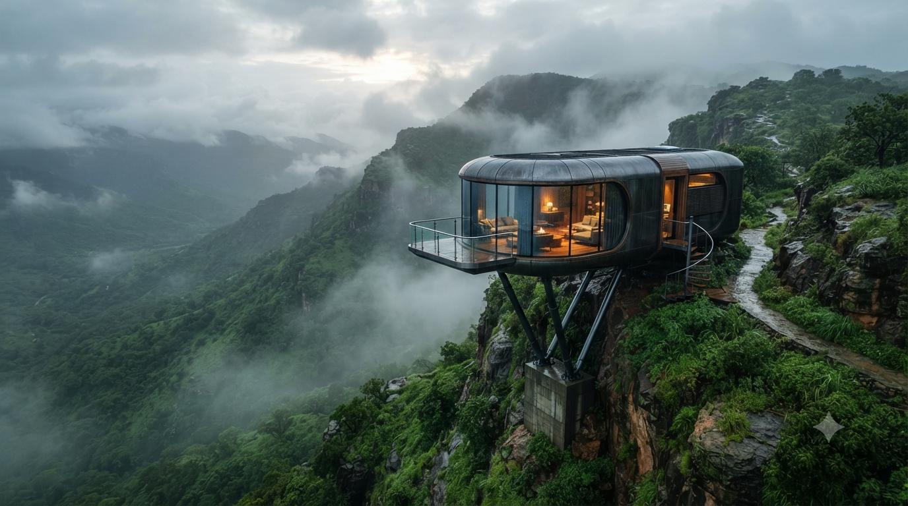

# 🗺️ أوسان عُمان | AWSAN OMAN

---

  

---

  
  
  

مستودع استراتيجي متكامل مخصص لإدارة وتطوير المشاريع السياحية والمعمارية المستقبلية الفاخرة في سلطنة عُمان. يعتمد هذا المستودع على هيكلية المشاريع المتعددة (Monorepo) لتوثيق الجوانب الهندسية، البيئية، والتقنية لكل وجهة يتم ابتكارها.

---

## 🚀 خارطة الطريق والمشاريع الحالية (Active Projects)

| الرقم | اسم المشروع | النطاق الجغرافي | الحالة | الرابط الداخلي |
| :--- | :--- | :--- | :--- | :--- |
| **01** | **منتجع أوسان عُمان البيئي المستقبلي** | جبال شُحيث، محافظة ظفار | 🟢 مكتمل الجوانب البصرية | [الانتقال للمشروع](./projects/01-shuhayt-eco-resort) |
| **02** | *المشروع القادم* | سيعلن عنه لاحقاً | ⚪ قيد التخطيط | `TBD` |

---

# 📌 المشروع الأول: منتجع أوسان عُمان البيئي (شُحيث)
**Awsan Oman Luxury Eco-Resort @ Shuhayt Cliffs**

  

مشروع سياحي مستقبلي فاخر يعتمد على مفهوم **"الكبسولات الذكية المعلقة"** وسياحة الاستشفاء والمغامرات البيئية، صُمم ليكون أيقونة معمارية عالمية تضع قرية **شُحيث** على خارطة السياحة المستدامة طوال العام، تماشياً مع "رؤية عُمان 2040".

## 📐 المعطيات الجغرافية والمساحات
* **الموقع المستهدف:** المرتفعات الجبلية لقرية شُحيث الجبلية العذراء (بين ولايتي طاقة وصلالة).
* **المساحة الإجمالية المطلوبة:** **200,000 متر مربع (20 هكتاراً)**.
  * **مساحة المرحلة الأولى:** 80,000 متر مربع (تطوير المرافق الأساسية والخدمية والترفيهية).
  * **مساحة التوسع المستقبلي:** 120,000 متر مربع (حرم بيئي طبيعي لضمان العزلة وللتوسعات المستقبلية).

---

## 🗺️ المخطط العام والمكونات الأساسية (Resort Zones)

### 1. الجناح الفندقي (Capsule Clusters)
* **الوحدات الفندقية:** كبسولات ذكية مستوردة (أبعاد 11.5م × 3.3م) مصنعة من ألومنيوم الطائرات المقاوم للرطوبة بنسبة 100%، وتضم واجهات زجاجية بانورامية منحنية ذكية عازلة للصوت والحرارة تتحول لمعتمة بلمسة زر لضمان الخصوصية.
* **التثبيت الهندسي:** ترتكز الكبسولات على ركائز فولاذية هيدروليكية معلقة فوق المنحدرات لحماية الغطاء النباتي الطبيعي، وتتصل ببعضها عبر ممرات خشبية معلقة مضيئة بإضاءة LED فيروزية (Cyan) دافئة ومستقبلية.

  

  

  
  

---
### 2. منطقة الطعام والاستجمام المركزية (The Cliff Hub)
* **مسبح الإنفينيتي المعلق:** مسبح دائري بقطر 25 متراً معلق على حافة الجرف الجبلي، مزود بنظام تدفئة متطور عبر الطاقة الشمسية لتقديم تجربة سباحة استثنائية وسط غيوم خريف ظفار.
* **المطعم البانورامي الدائري:** كبسولة زجاجية كبرى دائرية مزدوجة الطابق ممتدة فوق الوادي تمنح الزوار فرصة تناول الطعام بأعلى معايير الفخامة والعيش فوق السحاب.

  
  

---
### 3. المنطقة الخدمية والتجارية المستدامة (Retail & Parking)
* **المواقف الذكية:** مواقف سيارات ممتدة بطول 80 متراً مسقوفة بالكامل بمظلات من الألواح الشمسية (Solar Carports) لتوليد الطاقة النظيفة الهجينة للمنتجع وتوفير الظل الفاخر للمركبات.
* **قرية المتاجر الحجرية:** سوق ريفي مصغر مبني من حجر جبال ظفار المحلي والزجاج، يضم مقاهي مبتكرة ومتاجر لبيع اللبان الحوجري الطبيعي والمشغولات اليدوية لتمكين ودعم المجتمع المحلي لقرية شُحيث.

  

---

### 4. منطقة الترفيه المستدام للأطفال (Eco-Playground)
* **قرية المغامرات الخشبية:** منطقة ألعاب آمنة مصممة من الأخشاب والحبال الطبيعية على شكل بيوت شجرية تشبه كبسولات أوسان المصغرة، تضم جسور حبال معلقة منخفضة وآمنة.
* **الأنشطة المفتوحة:** سينما خارجية في الهواء الطلق (Outdoor Cinema)، منطقة التخييم التعليمي ورصد النجوم، ومسار المستكشف الصغير التفاعلي للتعرف على طبيعة المنطقة.

  
  

  

---

## 🔮 محاور التطوير المستقبلي والابتكار
1. **النقل الذكي المستدام (Futuristic Mobility):** عربات غولف كهربائية ذاتية القيادة تتحرك عبر ممرات الاستشعار، وخط تلفريك زجاجي مصغر (Cloud Cable Car) لربط المرتفعات بالمطعم المعلق.
2. **سياحة الاستشفاء والصحة البيئية (Spa Pod):** كبسولة مصممة للعلاجات الطبيعية تعتمد بالكامل على جلسات العلاج العطري بمستخلصات اللبان الحوجري العُماني.
3. **تكنولوجيا الفلك والواقع المعزز (AR Stargazing):** كبسولات ذات أسقف زجاجية بانورامية مجهزة بتلسكوبات رقمية ذكية لرصد النجوم والمجرات شتاءً وعرض البيانات الفلكية على الزجاج بتقنية الواقع المعزز.
4. **تجارب المغامرة الجبلية الشيقة (Extreme Adventure):** مسار زيبلاين (Zipline) انسيابي ممتد فوق السحاب، وأرجوحة المنحدر العملاقة (Canyon Swing) المعلقة فوق الجرف لعشاق الإثارة والتصوير العالمي.

---

## 🕌 الأصالة وتكامل الهوية العُمانية
* **موقد أوسان الجبلي:** ساحة ريفية فاخرة لتقديم لحم "المضبي" التقليدي المطهو على أحجار الوادي الساخنة ولهب حطب السمر أمام النزلاء.
* **مجلس السامر المفتوح:** ساحة دائرية حول موقد نار لتقديم القهوة واللبان الحوجري، والتعرف على الفنون الجبلية واللغة الشحرية القديمة بالتعاون مع مرشدين من سكان قرية شُحيث.
* **الهندسة البصرية التراثية:** دمج الفخاريات اليدوية وأقمشة النيلة التقليدية وتفاصيل اللبان العطري في الديكورات الداخلية للوحات التحكم والكبسولات الحديثة.

---

## ⚙️ معايير البيئة والاستدامة
* **صفر خرسانة ثقيلة:** الحفاظ الكامل على تضاريس جبل شُحيث من خلال التثبيت الهيدروليكي المرتفع عن الأرض.
* **الطاقة الهجينة المستدامة:** الدمج الذكي بين شبكة الكهرباء الحكومية العامة، الألواح الشمسية المدمجة على الأسطح والمواقف، والمولدات الصامتة الاحتياطية لمواجهة تقلبات خريف ظفار.
* **حماية البيئة الحيوية:** نظام صرف صحي بيئي مغلق (Eco-Septic) لمنع أي تسريب للتربة أو المياه الجوفية.

---

## 📜 الملكية الفكرية والحقوق (Intellectual Property)

جميع التصاميم، المخططات الهندسية، البنى الهيكلية، وأكواد توليد الهوية البصرية الموجودة داخل هذا المستودع مملوكة ومسجلة باسم مطور ومبتكر المشروع:
**AWSAN ADEL ABDULBARI AHMED SULTAN**

*جميع الحقوق محفوظة © 2026. يخضع المستودع لرخصة Creative Commons المانعة للاستخدام التجاري أو الاشتقاق غير المصرح به.*

---

